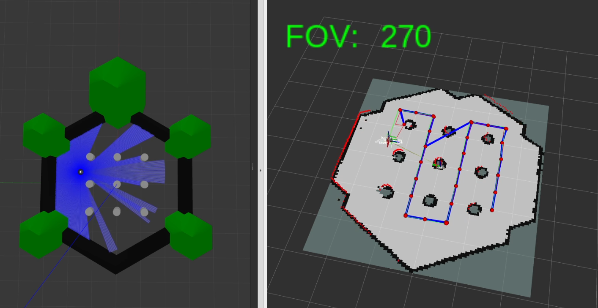

# Frontier_toolbox_ROS2
A package to investigate lidar-inhibited SLAM narrowing the FOV of a 2D lidar with slam_toolbox

## Overview
This package was created to study the performance of various frontier exploration algorithms paired wit slam_toolbox and Nav2 with both 360 degree and narrowed Field of View (FOV) on the LaserScan. Users can re-run my tests in simulation or on their own differential drive robots if they would like. 

The purpose of this package is to simulate a turtlebot3 with a 2D lidar sensor that may be "damaged" or "occluded" in it's usage. Using slam_toolbox, the goal is to investigate the performance drop as the robot loses some of its FOV from the lidar, and measure that to establish a baseline for future research seeking to improve performance in these settings using active learning.

## Package Dependencies
- ROS2 Humble
- Gazebo Classic
- slam_toolbox
- Nav2 (for nav_msgs)
- Robotis packages (clone from humble-devel)
    - turtlebot3
    - turtlebot3_msgs
    - turtlebot3_simulations
- PCL (Point Cloud Library)
    - pcl_conversions
    - pcl_ros (ros-humble-pcl-ros)
- libpcap-dev
## How to use

### Running a Full Simulation
1. Build the package and ensure that the packages turtlebot3, turtlebot3_msgs, turtlebot3_simulations, and all dependencies are installed and build on the `humble-devel` branch.
2. Source the workspace
3. Export the robot type using the command `export TURTLEBOT3_MODEL=<type>` where `<type>` can be burger or waffle.
4. Run the command `ros2 launch turtlebot_control launch_sim.launch.xml` to launch Gazebo classic, the intercept node, and Rviz. 
    - To initialize the robot with a smaller FOV, run the command `ros2 topic pub /fov std_msgs/msg/Int64 "{data: <FOV_degrees>}"` prior to launching. This will set the robot's FOV to <FOV_degrees>. This can also be modified dynamically during the simulation.
5. There are multiple ways to move the robot:
    - If you would like to move the robot via teleoperation, run teleop_twist_keyboard in another terminal.
    - To run the robot's predetermined path to snake through the pillars, run the command `ros2 run turtlebot_control choreographed` in another terminal with the workspace sourced. (NOTE: This will print out the normalized aggregated error when it stops moving, but the running error can be echoed from the `/error` topic at any time during the simulation. The path_publisher node will also print to terminal in debug mode.)
### Launching on a Real Robot
For users who would like to use this on their own robot. This can be done by simply...

### Using the Available Libraries
This package provides multiple library functions that could be utilized as a part of other ROS2 projects. By linking the libraries contained in the `frontier_exp_cpp` package, users can extract the functions used to identify frontiers, cluster them, or utilize any of the other helper functions. 