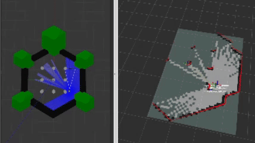
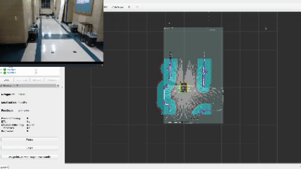

# frontier_toolbox
These packages are created to be an easy-to-use platform to rapidly prototype frontier exploration algorithms on a robot in various environments with both full and limited field of view sensor data. Through this package, users should be able to easily leverage the provided libraries to generate, cluster, and evaluate frontiers or integrate the provided component functions into their own novel approaches.

## Overview
This package was created to study the performance of various frontier exploration algorithms paired wit slam_toolbox and Nav2 with both 360 degree and narrowed Field of View (FOV) on the LaserScan. This narrow FOV simulated a 2D lidar sensor that may be "damaged" or "occluded" during usage. Users can re-run my tests in simulation or on their own differential drive robots if they would like. 

For those using this package some provided features include:
- Flatten a 3D to 2D lidar scan
- Systematically and dynamically corrupt lidar data
- Utilize my frontier generation library for other frontier exploration methods
- Utilize my clustering library to cluster frontiers with DBSCAN
- Test frontier algorithms provided in this package.

## Portfolio Post
To read more about this project, please visit my [portfolio website post!](https://schelbert197.github.io/portfolio/portfolio_featured/frontier/)

## Using this Repo
Detailed instructions on how to use the provided ROS2 packages and libraries to simulate or deploy your own robots can be found in the [use](use.md) file

## Package Dependencies
- ROS2 Humble
- Gazebo Classic
- slam_toolbox
- Nav2 (for nav_msgs)
- Robotis packages (clone from humble-devel)
    - turtlebot3
    - turtlebot3_msgs
    - turtlebot3_simulations
- PCL (Point Cloud Library)
    - pcl_conversions
    - pcl_ros (ros-humble-pcl-ros)
- libpcap-dev (to eliminate warn message)

## License
This package is released under the Apache-2.0 License. Related packages like Nav2 are licensed under thee BSD 2.0 License, but are not required for the usage of every package in this repository.