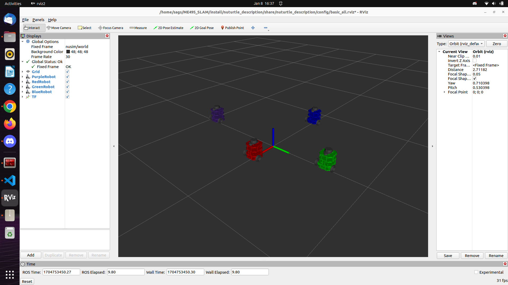
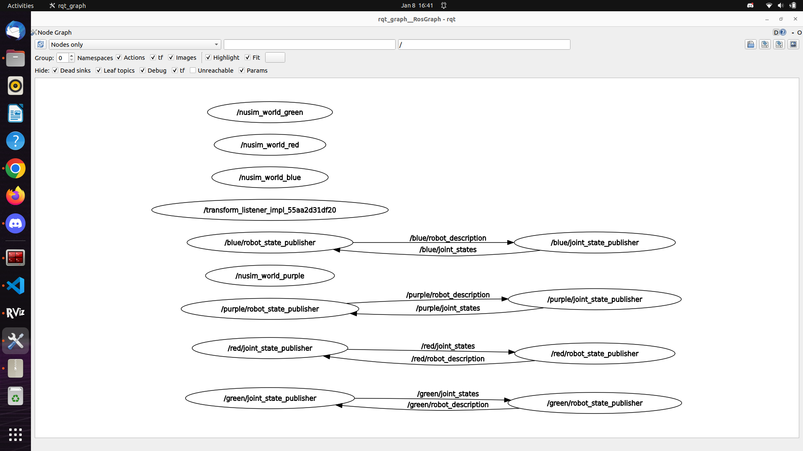

# Nuturtle  Description
URDF files for Nuturtle <Name Your Robot>
* `ros2 launch nuturtle_description load_one.launch.py color:=<color>` to see the robot in rviz in <color> of choice.
* `ros2 launch nuturtle_description load_all.launch.xml` to see purple, red, green, and blue copies of the robot in rviz.

* The rqt_graph when all four robots are visualized (Nodes Only, Hide Debug and tf) is:

# Launch File Details
* `ros2 launch nuturtle_description load_one.launch.py --show-args`
    Arguments (pass arguments as '<name>:=<value>'):

      'use_jsp':
          Choose to use joint_state_publisher. Valid choices are: ['true', 'false']
          (default: 'true')

      'use_rviz':
          Choose whether to launch RViz. Valid choices are: ['true', 'false']
          (default: 'true')

      'color':
          Sets the color argument in the turtlebot3 urdf. Valid choices are: ['red', 'green', 'blue', 'purple', '']
          (default: 'purple')
* `ros2 launch nuturtle_description load_all.launch.xml --show-args`
    Arguments (pass arguments as '<name>:=<value>'):

      'use_jsp':
          Choose to use joint_state_publisher. Valid choices are: ['true', 'false']
          (default: 'true')

      'use_rviz':
          Choose whether to launch RViz. Valid choices are: ['true', 'false']
          (default: 'true')

      'color':
          Sets the color argument in the turtlebot3 urdf. Valid choices are: ['red', 'green', 'blue', 'purple', '']
          (default: 'purple')