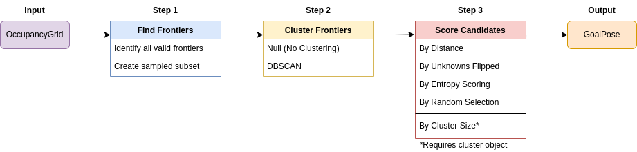
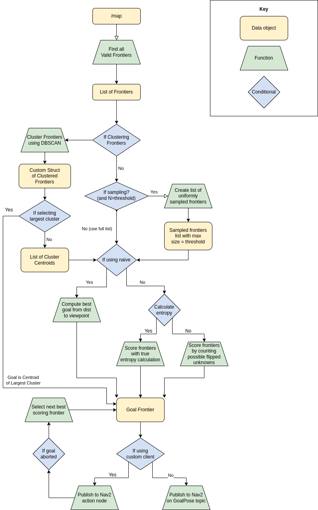

# Using the Package

## How to use
Trying this package should be easy! You can either integrate the libary functions in your own ROS2 node, or launch the provided nodes following the instructions in this document.

This document includes startup, parameters, and tuning instructions.

### Using the Available Libraries
This package provides multiple library functions that could be utilized as a part of other ROS2 projects. By linking the libraries `frontier_helper` and `dbscan` contained in the `frontier_exp_cpp` package, users can extract the functions used to identify frontiers, cluster them, or utilize any of the other helper functions. The below diagram shows some of the provided functions along with helper functions:

This means that users could mix-and-match functions from each cell to create novel frontier exploration algorithms. Some of the most important functions include:
1. Finding frontiers (contained in the FrontierHelper class):
    - findFrontiers
    - sampleRandomFrontiers (Note: Must be chained with findFrontiers)
2. Clustering (contained in the DBSCAN class):
    - clusterFrontiers
    - (doing nothing is an option, many of the scoring functions take the same input types)
3. Scoring candidate sets (contained in the FrontierHelper and DBSCAN classes):
    - selectByDistance
    - scoreByEntropy
    - scoreByFlipCount
    - findLargestCluster
    - findSecondLargestCluster
4. General helpful functions:
    - cellToWorld

While these are the most useful high level functions, the helper functions they employ (not listed) may also be useful.

### Running a Full Simulation
1. Build the packages from source and ensure that the packages turtlebot3, turtlebot3_msgs, turtlebot3_simulations, and all dependencies are installed and build on the `humble-devel` branch.
2. Source the workspace
3. Export the robot type using the command `export TURTLEBOT3_MODEL=<type>` where `<type>` can be burger or waffle.
4. Run the command `ros2 launch robot_mapping launch_sim.launch.xml` to launch Gazebo classic, the intercept node, and Rviz. 
    - NOTE: The launch file defaults to the turtle-shaped gazebo arena, however if you would like to launch the "house" world instead, run the command `ros2 launch robot_mapping launch_sim.launch.xml arena:=house`
    - To initialize the robot with a smaller FOV, run the command `ros2 topic pub /fov std_msgs/msg/Int64 "{data: <FOV_degrees>}"` prior to launching. This will set the robot's FOV to <FOV_degrees>. This can also be modified dynamically during the simulation.
5. There are multiple ways to move the robot:
    - **Teleoperation** - If you would like to move the robot via teleoperation, run teleop_twist_keyboard in another terminal.
    - **Pre-determined path** (turtle arena only) - To run the robot's predetermined path to snake through the pillars, run the command `ros2 run robot_mapping choreographed` in another terminal with the workspace sourced. (NOTE: This will print out the normalized aggregated error when it stops moving, but the running error can be echoed from the `/error` topic at any time during the simulation. The path_publisher node will also print to terminal in debug mode.)
    - **Frontier Exploration** - To run the frontier algorithms, ensure that the `frontier_exp_cpp` package was built with the correct configurations and run the command `ros2 launch frontier_exp_cpp nav_frontier.launch.py` in another terminal.
        - My frontier_explorer node is a lifecycle node that will self configure but **will wait to be activated**. To begin navigation, simple run `ros2 lifecycle set /frontier_explorer activate` in another terminal to start the exploration once the Nav2 bond timer has been set. 

### Launching on a Real Robot
For users who would like to use this on their own robot. This can be done by simply following these steps.

All steps are assumed to be done on the robot through an ssh terminal.
1. Ensure all packages have been built from source
2. Source the workspace install folder.
3. Run the command `ros2 launch robot_mapping launch_robot.launch.xml` in one of the terminals to start the necessary setup nodes without the simulation. 
4. In a second terminal run the commmand `ros2 launch frontier_exp_cpp nav_frontier.launch.py use_sim_time:=false`. 
    - NOTE: On my robot, the base frame was "base_link" not "base_footprint" which is a distiction built into the launch file. If this is different for you, ensure this corrected in the launch and params files. 
5. Once Nav2 is configured and the bond timer is set, activate my frontier node with `ros2 lifecycle set /frontier_explorer activate` which can be done on the local machine. 
6. (Optional) For those who wish to monitor the robot, there are two rviz configurations that can be launched:
    - `ros2 launch robot_mapping mapper_rviz.launch.py` (the config that launches with the `robot_mapping` package)
    - `ros2 launch frontier_exp_cpp robot_2d_nav_rviz.launch.py` (A fuller config that is setup with the Nav2 plugins)

## Package Parameters
The following parameters are in the `frontier_params.yaml` file in the `frontier_exp_cpp` package. 

- `use_naive` - Choose to use naive frontier selection or mutual information.

- `use_clustering` - Choose to use clustering to organize frontiers using DBSCAN.

- `eval_cluster_size` - Choose to select goal cluster by cluster size.

- `consider_free_edge` - Choose to consider an unoccupied map edge as a frontier.

- `use_action_client_node` - Choose to use custom action client node (true) or just publish goal pose to nav2 (false).

- `viewpoint_depth` - The distance in front of the robot that the naive algorithm chooses a frontier by min dist [m].

- `entropy_radius` - The radius around a frontier considered in a state update estimation.

- `robot_radius` - The radius around the robot in [m] to determine if a frontier is too close.

- `use_entropy_calc` - Choose whether to calculate entropy or select based on raw unknown count.

- `use_sampling` - Choose whether to use sampling to decrease computational load with many frontiers.

- `sampling_threshold` - The threshold at which after this many frontiers, the calculation will be sampled.

- `banning_radius` - The radius around which to consider a goal position banished from being a goal.

- `stuck_tolerance` - The tolerance which to consider the robot to be stuck (hasn't moved more than x[m]).

This flow diagram shows the decision tree of the provided `frontier_lc` node:

